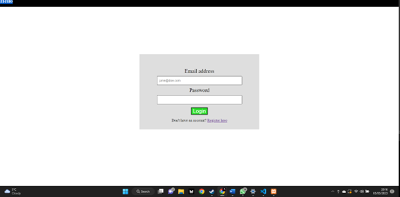
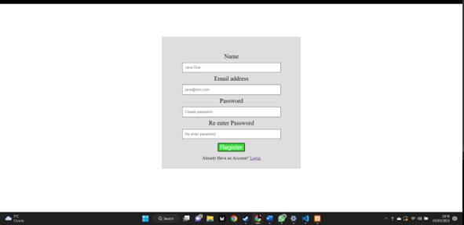
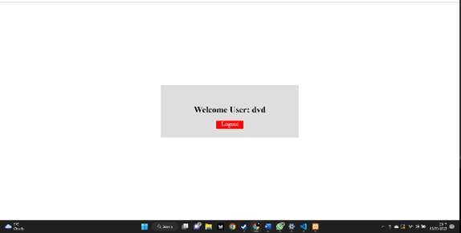

# README

## Index.php

A web application's login page is implemented using this PHP script. The `connection.php` file, which holds the database connection information, is the first thing the script needs. Afterwards a fresh session is initiated.

By examining whether the `user` session variable is set, the script determines if the user is already logged in. The script leads the user to the `dashboard.php` page if they are already logged in.

If a row is returned, the script uses the PHP `password_verify()` function to see if the entered password matches the one that was previously stored. The user's information is saved in the session variable and the user is forwarded to the `dashboard.php` page if the password is valid. The user is shown an error notice in all other cases.

The HTML code for the login form is then output by the script. The script displays the error message if there is a problem with the login procedure. There is a link to register if the user hasn't already.

## Connection.php

The PHP Data Objects (PDO) package, which offers a safe and effective method of dealing with databases, is used in this code to create a connection to a MySQL database. As a result of PDO's abstraction of database access, the developer is now able to create programmes that are not dependent on the underlying database management system.

Using PDO gives a number of advantages. To begin with, it offers a single interface for using several database systems, like MySQL, PostgreSQL, Oracle, etc. This indicates that little code modifications are sufficient to connect to several databases using the same PHP code.

Second, PDO provides a number of security measures that make it challenging for attackers to take advantage of application weaknesses. By separating SQL statements from user input, prepared statements, for instance, can assist prevent SQL injection attacks. By lowering the overhead associated with processing and compiling SQL queries, prepared statements further enhance performance.

## Register.php

The offered code is a PHP script that registers a user and adds their information into a database table named 'users'. Also, the script verifies user input and, if necessary, shows error messages. Using this code has the following advantages:

- Improved Security: The code connects to the database using the PDO package, which helps thwart SQL injection attacks. The password is additionally hashed using PHP's password hash function, which further strengthens the security of user data.
- Error handling: The script verifies user input and, if necessary, shows error messages. This makes the registration process more user-friendly by ensuring that the user inputs the right information into the form.
- Code reuse: The script includes the `connection.php` file, which contains the code for the database connection, using the `require_once` method. This makes it simpler to reuse the database connection code across various scripts and improves code reusability.
- User Session Management: The script starts a session for the current user using the `session_start()` function. Also, if the user is already logged in, it validates that fact and takes them to the `dashboard.php` page. This enhances the overall user experience while managing user sessions.
- Standardized Coding: The code accesses the database using PHP's PDO package, which offers a standardized method of working with databases in PHP. By doing this, the code is made to be more dependable in the long run and easier to maintain.

Overall, this code offers a quick and secure way to create user accounts and store user data in databases. Any online application may rely on it because it uses error handling, session management, and standardized development techniques.

Lastly, PDO has tools for handling errors that make it simple to deal with database exceptions and errors. When a mistake happens, PDO has the ability to throw exceptions, which

## Dashboard.php

Dashboard.php
This code establishes a connection to a database and starts a session. It checks whether the user is logged in and redirects them to the "index.php" page if not. The HTML document displays a greeting and the user's name, along with a logout button that takes the user to a logout.php page.

Overall, these PHP scripts provide a secure and efficient way to manage user accounts and store user data in databases. They use standardized coding techniques and error handling to ensure long-term reliability and ease of maintenance.
