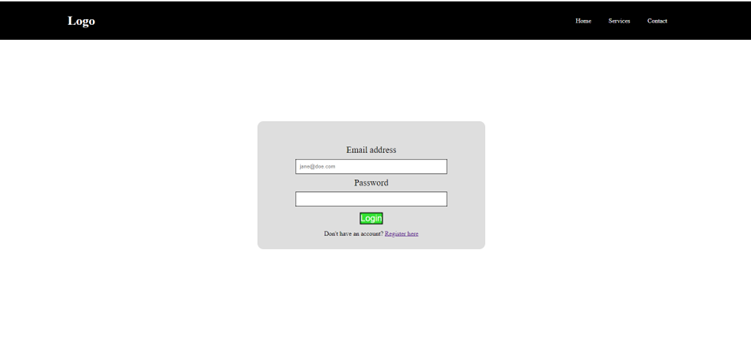
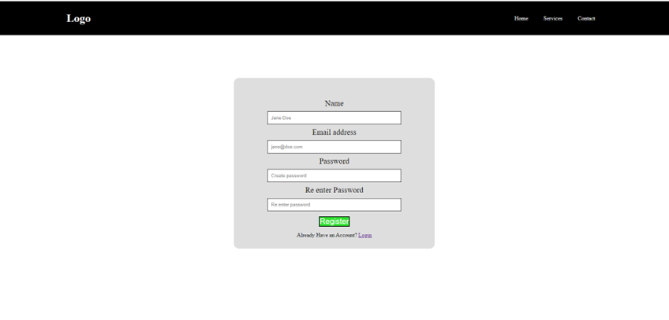
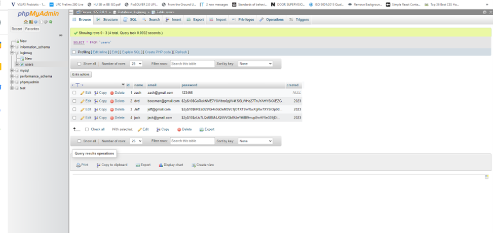
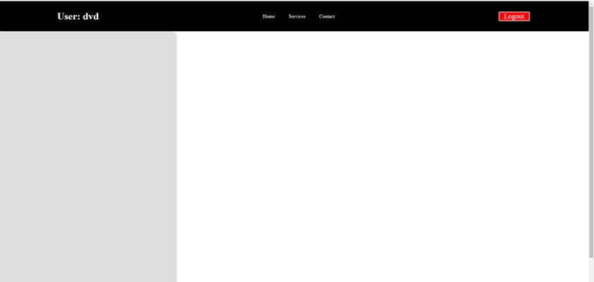

# README

Welcome to my PHP backend form validation code snippet assignment! In this assignment, I have created a code snippet that demonstrates how to validate user input using PHP on the server-side.

Form validation is an essential part of web development as it ensures that the data entered by users is accurate, complete, and safe. It helps to prevent errors, security vulnerabilities, and potential data loss.

In this code snippet, I have demonstrated how to validate different types of input fields such as text, email, password, and number fields. I have also included some commonly used validation techniques such as checking for required fields, valid email format, minimum and maximum character length, and numeric values.

## Index.php

The index page has a simple look with a navbar prominently displayed at the top. Users can easily access the many sections of the website thanks to the navbar's links to other web sites. Users may easily access the information they're seeking.

The index page has a login section with a link to register or sign up for the website in addition to the navbar. This enables users to register for an account and access any services that are only accessible to members. The login page is made to be simple to use and intuitive, with prompts and instructions that are easy to follow.

Generally, the index page isstraightforward and user-friendly entry point to thewebsite, with simple navigation, directions that are easy to follow, and a straightforward registration process for visitors who want to sign up.

Code:

The web application's login page is implemented using this PHP script. The `connection.php` file, which holds the database connection information, is the first thing the script needs. Afterwards a fresh session is initiated.

By examining whether the `user` session variable is set, the script determines if the user is already logged in. The script leads the user to the `dashboard.php` page if they are already logged in.

If a row is returned, the script uses the PHP `password_verify()` function to see if the entered password matches the one that was previously stored. The user's information is saved in the session variable and the user is forwarded to the `dashboard.php` page if the password is valid. The user is shown an error notice in all other cases.

The HTML code for the login form is then output by the script. The script displays the error message if there is a problem with the login procedure. There is a link to register if the user hasn't already.

## Connection.php

The PHP Data Objects (PDO) package, which offers a safe and effective method of dealing with databases, is used in this code to create a connection to a MySQL database. As a result of PDO's abstraction of database access, the developer is now able to create programmes that are not dependent on the underlying database management system.

Using PDO gives a number of advantages. To begin with, it offers a single interface for using several database systems, like MySQL, PostgreSQL, Oracle, etc. This indicates that little code modifications are sufficient to connect to several databases using the same PHP code.

Second, PDO provides a number of security measures that make it challenging for attackers to take advantage of application weaknesses. By separating SQL statements from user input, prepared statements, for instance, can assist prevent SQL injection attacks. By lowering the overhead associated with processing and compiling SQL queries, prepared statements further enhance performance.

## Register.php

New users can register for the website on the registration page, which has a simple, streamlined design that is simple to use. With simple instructions and prompts to lead users through the registration process, the website is designed to be user-friendly.

The registration form itself is simple to use and contains fields where users can fill in details about themselves, like their name, email address, and password. The registration procedure may be completed quickly and easily thanks to the clear instructions and prompts that walk the user through each stage.

Overall, new users may easily register and begin using thewebsite right away thanks to the registration page's straightforward, user-friendly, and effective design. Existing users can easily access their accounts by simply clicking the link to log in, which is clearly displayed.

Code:

The code is a PHP script that registers a user and adds their information into a database table named 'users'. Also, the script verifies user input and, if necessary, shows error messages.

Using this code has the following advantages:

- Improved Security: The code connects to the database using the PDO package, which helps thwart SQL injection attacks. The password is additionally hashed using PHP's password hash function, which further strengthens the security of user data.
- Error handling: The script verifies user input and, if necessary, shows error messages. This makes the registration process more user-friendly by ensuring that the user inputs the right information into the form.
- Code reuse: The script includes the `connection.php` file, which contains the code for the database connection, using the `require_once` method. This makes it simpler to reuse the database connection code across various scripts and improves code reusability.
- User Session Management: The script starts a session for the current user using the `session_start()` function. Also, if the user is already logged in, it validates that fact and takes them to the `dashboard.php` page. This enhances the overall user experience while managing user sessions.
- Standardized Coding: The code accesses the database using PHP's PDO package, which offers a standardized method of working with databases in PHP. By doing this, the code is made to be more dependable in the long run and easier to maintain.

Once the user has successfully registered their details through the registration form, their information will be securely stored in a MySQL database that has been specifically designed and created for this purpose. This means that users will be able to return to the website and log in with their username and password in the future.

By storing user information in a MySQL database, we can ensure that their data is safe, secure, and easily retrievable. This allows users to easily access their account information and make any necessary updates or changes.

The storage of user information in a MySQL database is a critical component of the registration process. It ensures that user data is secure and easily accessible, providing a foundation for a robust and scalable web application.

Overall, this code offers a quick and secure way to create user accounts and store user data in databases. Any online application may rely on it because it uses error handling, session management, and standardized development techniques.

Lastly, PDO has tools for handling errors that make it simple to deal with database exceptions and errors. When a mistake happens, PDO has the ability to throw exceptions, which

## Dashboard.php

The dashboard page is a personalized homepage that is accessible only after a user logs in to the website. It is designed to provide users with an overview of their account information and to allow them to access all of the features and benefits of the website from a single location.

At the top of the page, the user's username is prominently displayed in the navbar, providing a personalized touch and a sense of ownership over their account. In addition, there is a logout button located in the navbar, allowing the user to quickly and easilylog out of the website when they are finished using it.

Dashboard.php
This code establishes a connection to a database and starts a session. It checks whether the user is logged in and redirects them to the "index.php" page if not. The HTML document displays a greeting and the user's name, along with a logout button that takes the user to a logout.php page.

Overall, this PHP script provides a secure and efficient way to manage user accounts and store user data in databases. They use standardized coding techniques and error handling to ensure long-term reliability and ease of maintenance.
